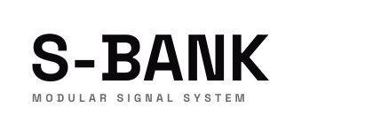

<picture>
  <source media="(prefers-color-scheme: dark)" srcset="logos/s-bank-wordmark-on-dark.svg">
  
</picture>

[](https://github.com/ogabrielluiz/s-bank/actions/workflows/ci.yml)

**The signal bank** — a library of analog-emulation DSP building blocks that help you
build VCV Rack modules with convincing analog behaviour and sound. Part of the
**Sam-e** signal system (`S-` is the signal). The library is the product; the modules
here are demos that use it to prove it works and show how.

The DSP is native, header-only C++, so it tests without the Rack SDK.

## Modules

- **Vactrol LPG** — a Buchla-292-style vactrol low-pass gate: dirty, resonant, with the
  lag and bloom of a real opto-isolator. Switches between low-pass, VCA, and combined
  responses.
- **Strike** — a clean, zero-bleed, envelope-driven low-pass gate. Sharp percussive
  pings with no tone leaking through a closed gate, plus a continuous material morph.

## Install

> Not yet in the VCV Library. For now:

- **Pre-built:** download the `.vcvplugin` for your platform from the
  [Releases](https://github.com/ogabrielluiz/s-bank/releases) page and drop it into
  Rack's user `plugins/` folder (Rack → *Help → Open user folder*).
- **From source:** you need the [VCV Rack SDK](https://vcvrack.com/manual/Building).

  ```sh
  cd modules/rack && make install RACK_DIR=/path/to/Rack-SDK
  ```

## Repo layout — the library vs. the demos

- **`modules/`** — VCV Rack modules built on the library:
  - [`rack`](modules/rack) — the native C++ VCV plugin: DSP cores
    (`src/dsp/SBankDSP.hpp`), module sources, panels, and `plugin.json`.
- **`tools/`** — [`panelgen`](tools/panelgen): declarative panel generator (one spec →
  both the SVG art and the C++ widget coordinates).
- **`site/`** — the Sam-e / S- brand living document.
- **`docs/`** — design notes ([`DESIGN.md`](docs/DESIGN.md)).

## Develop

The DSP is header-only, so the tests need no Rack SDK:

```sh
modules/rack/test/run_golden.sh                # golden regression (locks the sound)
c++ -std=c++11 -Wall -Wextra -pedantic -I modules/rack/src \
  modules/rack/test/dsp_smoke.cpp -o /tmp/sbank_dsp_smoke && /tmp/sbank_dsp_smoke
```

Panels are generated — edit the spec in `tools/panelgen`, never the SVG/`.inc` by hand,
then `python3 tools/panelgen/generate.py`. The
[PR template](.github/PULL_REQUEST_TEMPLATE.md) lists what CI enforces (golden
regression, panel sync, SPDX headers).

## License

S-Bank is open source with a per-area split — see [`LICENSE.md`](LICENSE.md) for the
authoritative breakdown:

- **Reusable DSP** (`modules/rack/src/dsp/`) — **MIT OR Apache-2.0**. Embed it in your
  own modules, open or commercial.
- **The demo plugin** and everything else — **GPL-3.0-or-later**.
- **Brand assets** — the panel designs (`res/*.svg`), the **Sam-e** / **S-Bank** names,
  the **S-** mark, and `site/` are © Gabriel Almeida, all rights reserved, and are **not**
  covered by the code licenses. Please don't reuse the names or the panel look on
  derivative works.
- Bundled fonts (Fira Code, Space Grotesk) are under the SIL Open Font License 1.1.
